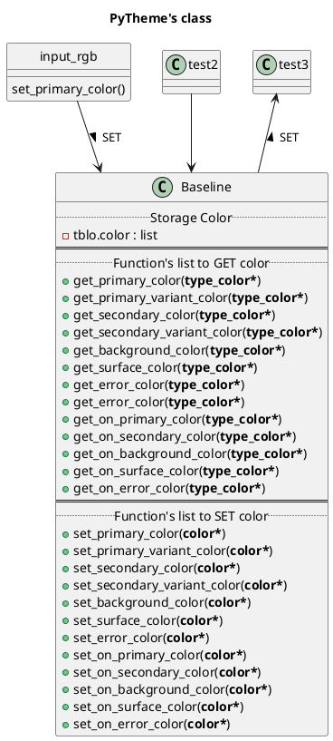

# <center>PyTheme Material Design

</center>

---

## Summary

- [<center>PyTheme Material Design](#centerpytheme-material-design)
  - [Summary](#summary)
  - [Description](#description)
  - [Installation](#installation)
  - [Usage](#usage)
    - [`color*` can be :](#color-can-be)
    - [`type_color*` can be:](#typecolor-can-be)
  - [Command list](#command-list)
    - [Command to set color](#command-to-set-color)
  - [Contributing](#contributing)
  - [Versionning](#versionning)
  - [Authors](#authors)
  - [License](#license)
  - [TODO](#todo)

## Description

Simple Class for color management's GUI with Material Design directives. If you want to build your GUI with a material theme, you can use this the project to manage your colors.

There is some colors's type to manage :
- Primary
- Primary Variant
- Secondary
- Secondary Variant
  
- Background
- Surface
- Error
  
- On Primary
- On Secondary
- On Background
- On Surface
- On Error


I create this program to learn python and github project practices.
I am working with the windows's pycharm app.

## Installation

- Clone repo :
  ```
  git clone https://github.com/jpa38/pytheme_material_design.git
  ```
- ~~Use `Requirement.txt` to install dependencies~~
  ```
  pip install -r requirements.txt
  ```

## Usage

1. Import the class
```python
from pytheme_material_design.pytheme_color.color import Baseline
 ```

2. Create your class :
```python
myguicolor = Baseline()
```

3. Set your colors:

> You can set Hexa color (type `str`) or RGB color (type `list` or type `tuple`)


```python
myguicolor.set_primary_color('#6200EE')
```
or
```python
myguicolor.set_primary_color([92,0,93.3])
```

3. Get your color in your GUI's code

```python
myguicolor.get_primary_color("rgb")
```
Return `[92,0,93.3]`

If you want to view an palette with your color:
```python
todo
```
## Diagram class


<!---

-->

### `color*` can be :

| COLOR 	| Example **INPUT**                           	| Type       	|
|-------	|---------------------------------------------	|------------	|
| hexa  	| #66cdaa                                     	| String     	|
| rgb   	| (102, 205, 170) / [102, 205, 170]           	| Tuple/List 	|
| rgba  	| (102, 205, 170, 1.0) / [102, 205, 170, 1.0] 	| Tuple/List 	|


### `type_color*` can be:

| MODE     	| Example OUTPUT             	| Type   	|
|----------	|--------------------------	|--------	|
| hexa     	| #66cdaa                  	| String 	|
| rgb      	| (102, 205, 170)          	| Tuple  	|
| rgba     	| (102, 205, 170, 1.0)     	| Tuple  	|
| rgb_0_1  	| (0.4, 0.804, 0.667)      	| Tuple  	|
| rgba_0_1 	| (0.4, 0.804, 0.667, 1.0) 	| Tuple  	|
| hsl      	| Experimental             	| Tuple  	|
| hsla     	| Experimental             	| Tuple  	|
| hls      	| Experimental             	| Tuple  	|
| yiq      	| Experimental             	| Tuple  	|
| hsv      	| Experimental             	| Tuple  	|


## Command list

### Command to set color

You can set an color by two types:
1. `hexadecimal` color, `string type`, the first character must be `#`
2. `rgb decimal` color, `tuple` or `list` type

Avaible commands :


## Contributing

Write your comments with the Google Style Python Docstrings

- Document code with google style, check your pycharm's settings :
    Go to `File | Settings | Tools | Python Integrated Tools`
    - Find `Docstring format` and put  `Google`

- Comment's particularities, Go to `File | Settings | Editor | TODO`
    - To improve the reading's code comment:
        - `titre .*`  = title level 1
        - `titre- .*`  = title level 2
        - `titre-- .*`  = title level 3
    - To remember to check an utility :
        - `\bused\b.*`
    - To remember the futur improve functionalities :
        - `\bupgrademe\b.*`


## Versionning

We use [SemVer](http://semver.org/) for versioning :


    Given a version number MAJOR.MINOR.PATCH, increment the:

        1. MAJOR version when you make incompatible API changes,
        2. MINOR version when you add functionality in a backwards-compatible manner, and
        3. PATCH version when you make backwards-compatible bug fixes.

## Authors
- Jérôme PALANCA

## License

This project is licensed under the **MIT License**

## TODO
- [ ] todo
